# 搭建 pnpm + changesets 项目模板实践

## 前言

随着业务复杂度的直线提升，前端项目不管是从代码量上，还是从依赖关系上都呈爆炸式增长。同时，由于团队中不止有一个业务项目，所以“多个项目之间如何配合”
“如何维护相互关系” “公司自己的公共库版本如何管理” 这些问题随着业务扩展纷纷浮出水面。

鉴于上述种种问题，业界也有一些最佳实践，基于pnpm + changesets的方式就是其中之一，接下来会对这些工具的概念以及基本使用进行介绍。

## monorepo 和 multirepo

multirepo，顾名思义，就是按照功能模块划分，一个模块对应一个仓库，典型案例就是公司中台业务模块前端项目就是按照multirepo的方式进行管理；而monorepo
就是将应用的所有模块一股脑全放在一个项目中，这样就避免了上面提到的问题，不需要单独发包，测试，且所有代码都在一个项目中管理，一同部署上线，能够在
开发阶段更早的复现bug，暴露问题。

multirepo存在以下问题：

- 开发调试及版本更新效率低下。
- 团队技术选型分撒，不同库的实现风格可能存在较大差异（比如有的库依赖Vue，有的库依赖React）。
- changelog 梳理困难，Issues 管理混乱（对应开源库来说）。

而 monorepo 缺点也非常明显，具体如下。

- 库体积超大，目录结构复杂度上升。
- 需要使用维护 monorepo 的工具，这就意味着学习成本比较高。
- 对于管理者来说, 无法进行精准的权限控制（这个应该有方案）

## 什么是pnpm？它有哪些优势？

pnpm 全称是 “Performant NPM”，即高性能的 npm。

它的主要优点如下:

- 能够大大节省磁盘空间，不同于npm，同一个依赖被不同的项目使用时，都会被重复安装一次，而pnpm则会将依赖按版本进行存储，如果在存储中心能够找到此依赖，
  则会将包里的文件硬链接到存储中心中对应依赖的位置，不会重复安装。
- 大大提高了安装速度，之前安装过的依赖都会直接从存储中心中获取并链接到项目的node_modules中。
- 避免出现幽灵依赖的问题，默认情况下，pnpm 使用符号链接将项目的直接依赖项添加到模块目录的根目录中，而对应的在项目中，我们只可以访问package.json
  文件中声明过的依赖项，无法访问未声明的的依赖项，想了解更多可以点击查看[平铺的结构不是 node_modules 的唯一实现方式 | pnpm](https://pnpm.io/zh/blog/2020/05/27/flat-node-modules-is-not-the-only-way)

### 使用 npm 安装

> npm install -g pnpm

之后便可用 pnpm 代替 npm 命令了，以下是简便的 npm 命令等效列表，可帮助您入门：

| npm 命令        | pnpm 等效        |
| :-------------- | :--------------- |
| npm install     | pnpm install     |
| npm i \<pkg\>   | pnpm add \<pkg\> |
| npm run \<cmd\> | pnpm \<cmd\>     |

### 下图是与其它包管理器的比较


## pnpm Workspace

### 如何启用

一个 workspace 的根目录下必须有 pnpm-workspace.yaml 文件， 也可能会有 .npmrc 文件。

###

pnpm-workspace.yaml示例:

```yaml
packages:
  - packages/* # packages 目录下都是组件包
```

## Workspace 协议

WorkSpace协议是pnpm支持Monorepo的一个重要功能，它可以指定工作空间内的包依赖关系。

举个例子，xbuild的目录结构如下：

```text
├── packages
│   ├── babel-preset-xbuild-app
│   │   └── package.json
│   ├── shared-utils
│   │   └── package.json
│   ├── swc-options
│   │   └── package.json
│   └── service
│       └── package.json
├── package.json
└── pnpm-workspace.yaml
```

在这个项目中，@xm/xbuild-service 包依赖了@xm/babel-preset-xbuild-app、@xm/xbuild-shared-utils、@xm/xbuild-swc-options 这三个包（这
里包名指的是package.json中name的值，不是包的目录名称），那么我们可以通过别名引用。

比如，在 @xm/xbuild-service 包的 package.json 文件中声明:

```json
{
  "name": "@xm/xbuild-service",
  "version": "0.2.34",
  "dependencies": {
    "@xm/babel-preset-xbuild-app": "workspace:*",
    "@xm/xbuild-shared-utils": "workspace:*",
    "@xm/xbuild-swc-options": "workspace:~"
  }
}
```

这样在根目录进行 pnpm install 时，pnpm会自动帮我们处理包之间的引用关系。

当我们发布 workspace 包时，pnpm 会动态替换这些 workspace: 依赖：

- 目标 workspace 中的对应版本（如果使用 workspace:\*, workspace:~, or workspace:^）
- 相关的 semver 范围（对于任何其他范围类型）

还是用上面例子举例：

```json
{
  "dependencies": {
    "@xm/babel-preset-xbuild-app": "workspace:*",
    "@xm/xbuild-shared-utils": "workspace:*",
    "@xm/xbuild-swc-options": "workspace:~"
  }
}
```

将会被转化为：

```json
{
  "dependencies": {
    "@xm/babel-preset-xbuild-app": "0.2.12",
    "@xm/xbuild-shared-utils": "0.0.13",
    "@xm/xbuild-swc-options": "~0.2.28"
  }
}
```

这里的 0.2.12、0.0.13、0.2.28 是对应包具体版本号，这个功能允许你发布转化之后的包到远端，并且可以正常使用本地 workspace 中的 packages，而
不需要其它中间步骤。

包的使用者也可以像常规的包那样正常使用，且仍然可以受益于[语义化版本](https://semver.org/lang/zh-CN/)。

## 在 pnpm 中使用 Changesets

### 配置

要在 pnpm 工作空间上配置 changesets，请将 changesets 作为开发依赖项安装在工作空间的根目录中：

> pnpm add -Dw @changesets/cli

-D 将指定的 packages 安装为 devDependencies

-w 在工作空间的根目录中启动 pnpm ，而不是当前的工作目录

然后 changesets 的初始化命令：

> pnpm changeset init

## 开发模板

基于 dumi + father + pnpm + changesets 多包管理模板

### feature

✅ 多包管理
✅ 单元测试
✅ 文档阅读
✅ eslint 规范
✅ cjs + esm 编译
✅ typescript

### 快速开始

1. 初始化项目

(1) 安装pnpm

```bash
npm install -g pnpm
```

(2) 新建 pnpm-changesets-template 项目

```bash
mkdir pnpm-changesets-template && cd pnpm-changesets-template
```

(3) 初始化package.json

```bash
pnpm init
```

(4) 配置 .npmrc

此外，我们要额外创建pnpm的配置文件：.npmrc，配置如下：

```text
shamefully-hoist=false
```

shamefully-hoist的含义：

默认情况下，pnpm 创建一个半严格的 node_modules，这意味着依赖项可以访问未声明的依赖项，但 node_modules 之外的模块不行。
通过这种布局，生态系统中的大多数的包都可以正常工作。 但是，如果某些工具仅在提升的依赖项位于根目录的 node_modules 时才有效，
您可以将其设置为 true 来为您提升它们。

(6) 创建 packages 目录

```bash
mkdir packages
```

(7) 创建工作空间
在项目根目录下新建 pnpm-workspace.yaml 文件，里面添加如下配置，这样在packages范围下的包都能共享工作空间了。

```yaml
packages:
  - 'packages/*'
```

2. 统一开发环境

开发环境的统一，主要是统一Node版本和pnpm，我们可以通过在package.json中配置一些字段来统一开发环境。

(1) 限制Node版本和pnpm
通过配置volta和engines限制Node和pnpm的版本

```json
{
  "volta": {
    "node": "16.19.1"
  },
  "engines": {
    "node": "16.19.1",
    "pnpm": ">=8"
  }
}
```

(2) 限制项目只能通过pnpm初始化依赖

```json
{
  "scripts": {
    "preinstall": "npx only-allow pnpm"
  }
}
```

如果开发环境不能满足条件，会报错:
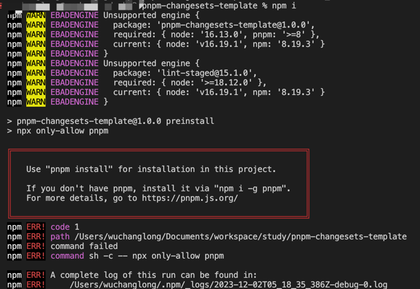

3. 集成changesets

(1) 安装 @changesets/cli 包

```bash
pnpm add -Dw @changesets/cli
```

(2) 执行 changesets 的初始化命令

```bash
pnpm changeset init
```

这个时候会生成一个 .changeset 目录，里面会生成一个 changeset 的 config 文件：

```json
{
  "$schema": "https://unpkg.com/@changesets/config@2.3.1/schema.json",
  "changelog": "@changesets/cli/changelog",
  "commit": false,
  "fixed": [],
  "linked": [],
  "access": "restricted",
  "baseBranch": "main",
  "updateInternalDependencies": "patch",
  "ignore": []
}
```

4. 集成ESlint

eslint 是一个代码检测工具，用于检测代码中潜在的问题和错误，作用提高代码质量和规范。

(1) 安装eslint

```bash
pnpm i eslint -Dw
```

(2) 执行完成后，自动生成 eslint 配置文件.eslintrc.js 可在 .eslintrc.js 中配置 rules 定义校验规则

(3) 快速构建 eslint 配置文件

```bash
pnpm create @eslint/config
```

参考如下截图：

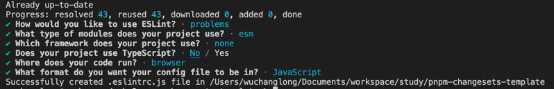

.eslintrc.js 文件内容如下：

```js
module.exports = {
  env: {
    browser: true,
    es2021: true
  },
  extends: 'eslint:recommended',
  overrides: [
    {
      env: {
        node: true
      },
      files: ['.eslintrc.{js,cjs}'],
      parserOptions: {
        sourceType: 'script'
      }
    }
  ],
  parserOptions: {
    ecmaVersion: 'latest',
    sourceType: 'module'
  },
  rules: {}
}
```

(4) 支持TypeScript

在 TypeScript 项目中使用 ESLint 是一种很好的做法，可以帮助您保持代码的一致性和质量。以下是如何结合 TypeScript 和 ESLint 的步骤：

(4.1). 安装和配置 ESLint： 首先，您需要在项目中安装 ESLint。运行以下命令来安装 ESLint 和 TypeScript 解析器：

```bash
pnpm add eslint @typescript-eslint/parser @typescript-eslint/eslint-plugin@latest -Dw
```

(4.2). 在 .eslintrc.js 中加入如下配置：

```js
module.exports = {
  parser: '@typescript-eslint/parser',
  env: {
    node: true,
    browser: true,
    es2021: true
  },
  extends: ['eslint:recommended', 'plugin:@typescript-eslint/recommended'],
  ignorePatterns: ['**/*.test.js'],
  // 其他 ESLint 配置
  plugins: ['@typescript-eslint'],
  overrides: [
    {
      env: {
        node: true
      },
      files: ['.eslintrc.{js,cjs}'],
      parserOptions: {
        sourceType: 'script'
      }
    }
  ],
  parserOptions: {
    ecmaVersion: 'latest',
    sourceType: 'module'
  },
  rules: {}
}
```

5. 集成husky

husky 是一个 Git 钩子（Git hooks）工具，它可以让你在 Git 事件发生时执行脚本，进行代码格式化、测试等操作。

常见的钩子

- pre-commit：在执行 Git commit 命令之前触发，用于在提交代码前进行代码检查、格式化、测试等操作。
- commit-msg：在提交消息（commit message）被创建后，但提交操作尚未完成之前触发，用于校验提交消息的格式和内容。
- pre-push：在执行 Git push 命令之前触发，用于在推送代码前进行额外检查、测试等操作。

(1) 安装

> 注意！需要在 .git 文件同目录下安装 husky，否则无法识别环境导致安装失败！

- 初始化git仓库

```bash
git init
```

(2) 并在根目录下新建 .gitignore 文件，复制以下文本到 .gitignore 文件中

```text
node_modules
dist
.idea
.vscode
*-error.log

.DS_Store
Thumbs.db
*.zip

lib
/**/.pnpm-debug.log
/.npm
```

(3) 在项目根目录下运行以下命令安装 husky：

```bash
pnpm i husky -Dw
```

(4) 启用 git 钩子 输入以下命令（这里不能使用 pnpm 代替，会报错）

```bash
npm pkg set scripts.prepare="husky install"
```

(5) 安装成功后会在 package.json 文件中 script 中生成命令

> 注意！如果不是命令行生成，则需要手动将如下内容粘贴到 package.json 文件中

```json
{
  "scripts": {
    "prepare": "husky install"
  }
}
```

执行如下代码，生成 .husky 目录

```bash
pnpm prepare
```

如图，执行成功后，项目中生成一个 .husky 目录

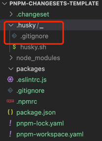

(6) 创建 Git 挂钩 pre-commit，在 Git 提交之前做eslint 语法校验 。

```bash
pnpm husky add .husky/pre-commit "npm test"
```

执行成功，.husky 目录多出一个 pre-commit 文件

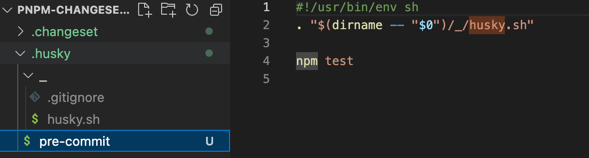

(7) 配置代码检测

git 提交前，执行 pre-commit 钩子脚本，进行校验代码语法、格式修复等操作。

打开 pre-commit 文件，内容如下：

```shell
#!/usr/bin/env sh
. "$(dirname -- "$0")/_/husky.sh"

npm test
```

下方代码添加到 pre-commit 文件中。lint-staged模块， 用于对 git 暂存区检测

```text
npx --no-install lint-staged
```

> npx --no-install lint-staged 是一个命令，用于在不安装 lint-staged 的情况下运行该工具。npx --no-install 命令用于从远程下载并执行指定的命令。

6. 集成lint-staged

作用：lint-staged 可以让你在 Git 暂存（staged）区域中的文件上运行脚本，通常用于在提交前对代码进行格式化、静态检查等操作。

- 作用：lint-staged 可以让你在 Git 暂存（staged）区域中的文件上运行脚本，通常用于在提交前对代码进行格式化、静态检查等操作。
- 使用方式：你可以在项目中使用 lint-staged 配合 husky 钩子来执行针对暂存文件的脚本。具体的使用步骤如下：

(1) 在项目根目录下运行以下命令安装 lint-staged：

```bash
pnpm i lint-staged -Dw
```

(2) 在 package.json 文件中添加以下配置：

```json
{
  "lint-staged": {
    "*.{js,jsx,ts,tsx}": ["eslint --fix"]
  }
}
```

"\*.{js,jsx,ts,tsx}" 是指定要针对的暂存文件模式，你可以根据自己的项目需求来配置。
eslint --fix 为校验命令，可执行 eslint 等规则

7. 集成prettier

prettier 是一个代码格式化工具。prettier 与上述 husky 和 lint-staged 搭配使用，可以在提交代码之前自动格式化代码。具体的使用步骤如下：

在项目根目录下运行以下命令安装 prettier：

```bash
pnpm i prettier -Dw
```

在项目根目录下新建 .prettierrc.js 文件，并定义你想要的代码样式，例如：

```js
module.exports = {
  semi: false, // 在语句末尾，仅在可能导致 ASI 失败的行开头添加分号
  trailingComma: 'none', // 在多行逗号分隔的语法结构中, 没有尾随逗号
  arrowParens: 'avoid', // 在唯一的箭头函数参数周围, 尽可能省略括号
  tabWidth: 2, // 指定每个缩进级别的空格数
  singleQuote: true, // 使用单引号而不是双引号
  printWidth: 100, // 最大行长度字符数
  bracketSpacing: true, // 对象字面量之间保留空格
  bracketSameLine: true // 将多行 HTML（HTML、JSX、Vue、Angular）元素的 > 放在最后一行的末尾，而不是单独放在下一行（不适用于自闭合元素）
}
```

这里的配置选项根据你的需求定义，具体选项可以参考 [prettier 文档](https://www.prettier.cn/docs/options.html)。 在 lint-staged 的配
置中添加 "prettier --write"，例如：

```json
{
  "lint-staged": {
    "*.{js,jsx,ts,tsx}": ["prettier --write", "eslint --fix"]
  }
}
```

- "prettier --write" 为校验命令，可执行 prettier 等规则

新建 .prettierignore 文件，并定义你想要 prettier 忽略的文件

```text
# Ignore artifacts:
coverage
node_modules
dist
.changeset
**/public
**/.umi
lib
```

这样当你进行 GIT 提交操作时，lint-staged 将自动运行 prettier 来格式化符合规则的文件。

- 配置 ctrl + s，自动保存功能

第一种，在vscode中配置：左下角设置 => 工作区 => 文本编辑器

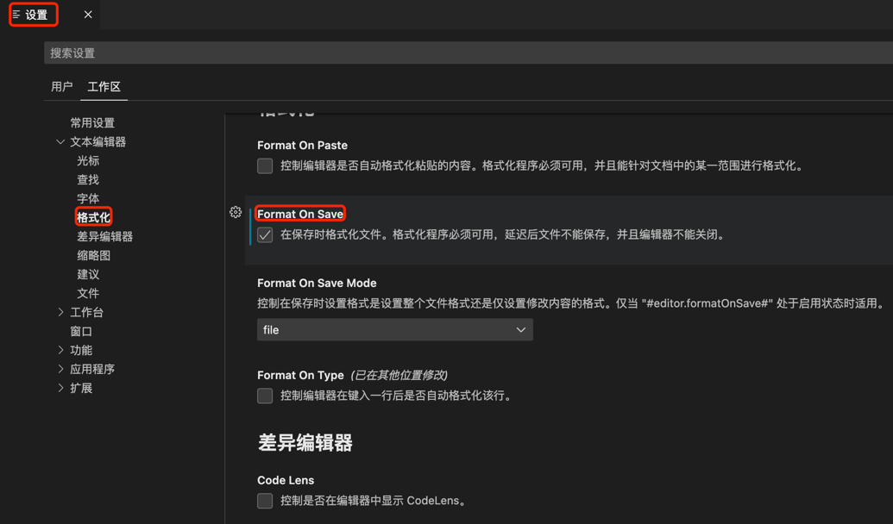

第二种，在WebStorm中配置：右上角设置 => Preferences => Languages & Framework => JavaScript => Prettier

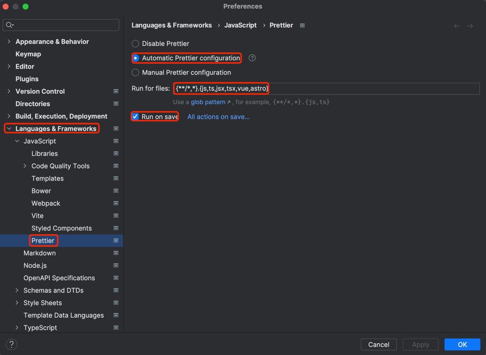

8. 集成Commitizen

- 是一个命令行工具，用于以一致的方式编写规范的提交消息。在使用 Commitizen 之前，你需要安装 Commitizen 及其适配器。

- cz-conventional-changelog 是 Commitizen 的一个适配器，它实现了符合约定式提交（Conventional Commits）规范的提交消息。该规范定义了提交消息的格式和结构，并推荐了一些常用的提交类型和范围

(1) 安装

```bash
pnpm add commitizen cz-conventional-changelog -Dw
```

(2) 安装完成后，在 package.json 中添加一个 config.commitizen 的字段，并设置它的值为 cz-conventional-changelog。示例如下：

```json
{
  "config": {
    "commitizen": {
      "path": "cz-conventional-changelog"
    }
  }
}
```

(3) 在 package.json 中的 scripts 字段中添加一个 commit 的命令。 示例如下：

```json
{
  "scripts": {
    "commit": "git-cz"
  }
}
```

我们可以使用 `pnpm commit` 代替 `git commit` 命令来进行交互式提交。

```bash
git add .
pnpm commit
```

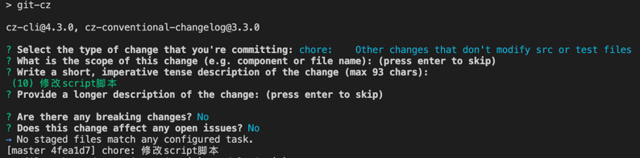

详细文档：[Git Guide
Angular提交信息规范](https://zj-git-guide.readthedocs.io/zh-cn/latest/message/Angular%E6%8F%90%E4%BA%A4%E4%BF%A1%E6%81%AF%E8%A7%84%E8%8C%83/)

9. 集成commitlint

- 作用：commitlint 用于校验 Git 提交信息的格式是否符合预定义的规范。
- 使用方式：你可以在项目中使用 commitlint 来规范提交信息的格式，例如使用约定式提交（Conventional Commits）的格式。具体的使用步骤如下：

(1) 在项目根目录下运行以下命令安装 commitlint

```bash
pnpm add @commitlint/cli @commitlint/config-conventional -Dw
```

(2) 在项目根目录下创建 commitlint.config.js 文件，并添加以下配置：

```js
module.exports = {
  extends: ['@commitlint/config-conventional']
}
```

(3) 这里使用了 `@commitlint/config-conventional` 包提供的预定义配置，可根据需要自定义配置。你还可以在配置文件中定义自己的规则。

在 package.json 文件中添加以下配置：

```json
{
  "scripts": {
    "commitmsg": "commitlint -E HUSKY_GIT_PARAMS"
  }
}
```

(4) 修改 husky 的配置，添加 "commit-msg" 钩子事件如下：

```json
{
  "husky": {
    "hooks": {
      "commit-msg": "npm run commitmsg"
    }
  }
}
```

或者使用命令创建钩子脚本文件

```bash
npx husky add .husky/commit-msg  'npx --no -- commitlint --edit ${1}'
```

执行成功，.husky 目录多出一个 `commit-msg` 文件

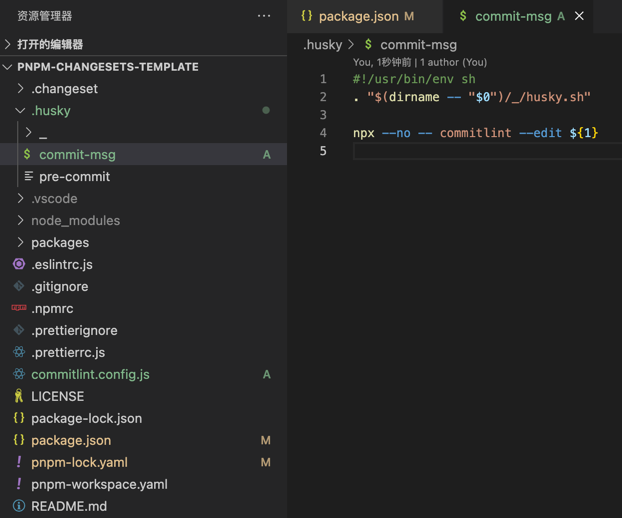

这样当你进行提交信息时，commitlint 将自动校验提交信息的格式是否符合预定义规范，并给出相应的提示和错误

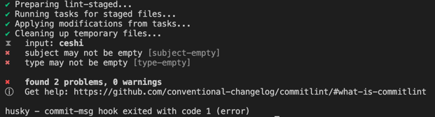

10. 集成Jest

(1) 安装Jest

```bash
pnpm add Jest -Dw
```

(2) 解决 `eslint` 报错

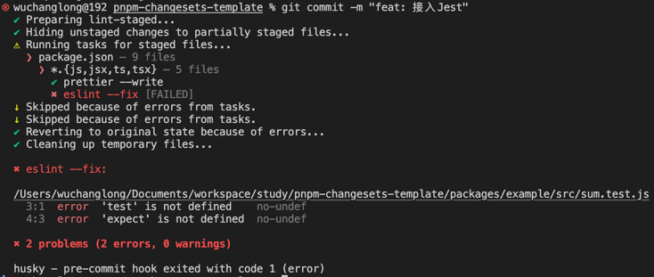

这个问题通常是因为您的 ESLint 配置中没有包含 Jest 的相关规则。为了解决这个问题，您可以考虑以下步骤：

(3) 使用 eslint-plugin-jest： 您可以使用 eslint-plugin-jest 来规范 Jest 单元测试代码。这个插件提供了一些有用的规则，可以帮助您编写更规范的测试代码。

在您的项目中安装 eslint-plugin-jest：

```bash
pnpm add eslint-plugin-jest -Dw
```

(4) 将 jest 添加到 .eslintrc 配置文件的插件部分。您可以省略 eslint-plugin- 前缀：

```json
{
  "plugins": ["jest"]
}
```

(5) 然后在规则部分配置您要使用的规则。

```json
{
  "rules": {
    "jest/no-disabled-tests": "warn",
    "jest/no-focused-tests": "error",
    "jest/no-identical-title": "error",
    "jest/prefer-to-have-length": "warn",
    "jest/valid-expect": "error"
  }
}
```

参考文档：[eslint-plugin-jest](https://github.com/jest-community/eslint-plugin-jest)

11. 集成father

father 是一款 NPM 包研发工具，能够帮助开发者更高效、高质量地研发 NPM 包、生成构建产物、再完成发布。

根据官网介绍，它提供了如下特性：

- ⚔️ 双模式构建： 支持 Bundless 及 Bundle 两种构建模式，ESModule 及 CommonJS 产物使用 Bundless 模式，UMD 产物使用 Bundle 模式
- 🎛 多构建核心： Bundle 模式使用 Webpack 作为构建核心，Bundless 模式支持 esbuild、Babel 及 SWC 三种构建核心，可通过配置自由切换
- 🔖 类型生成： 无论是源码构建还是依赖预打包，都支持为 TypeScript 模块生成 .d.ts 类型定义
- 🚀 持久缓存： 所有产物类型均支持持久缓存，二次构建或增量构建只需『嗖』的一下
- 🩺 项目体检： 对 NPM 包研发常见误区做检查，让每一次发布都更加稳健
- 🏗 微生成器： 为项目追加生成常见的工程化能力，例如使用 jest 编写测试
- 📦 依赖预打包： 开箱即用的依赖预打包能力，帮助 Node.js 框架/库提升稳定性、不受上游依赖更新影响（实验性）

(1) 安装

```bash
pnpm add father -Dw
```

(2) 添加 .fatherrc.js 配置文件：

```js
export default {
  // 以下为 esm 配置项启用时的默认值，有自定义需求时才需配置
  esm: {
    input: 'src', // 默认编译目录
    platform: 'browser', // 默认构建为 Browser 环境的产物
    transformer: 'babel' // 默认使用 babel 以提供更好的兼容性
  },
  cjs: {
    input: 'src', // 默认编译目录
    platform: 'node', // 默认构建为 Node.js 环境的产物
    transformer: 'esbuild' // 默认使用 esbuild 以获得更快的构建速度
  }
}
```

默认会在 .fatherrc.js 所在的同级目录下生成 dist 目录，其中cjs目录下的文件为 CommonJS 产物，esm目录下的文件为 ESModule 产物。

12. 集成dumi

dumi，是一款为组件开发场景而生的静态站点框架。

根据官网介绍，它提供了如下特性：

- 🚀 更好的编译性能：通过结合使用 Umi 4 MFSU、esbuild、SWC、持久缓存等方案，带来比 dumi 1.x 更快的编译速度
- 🔍 内置全文搜索：不需要接入任何三方服务，标题、正文、demo 等内容均可被搜索，支持多关键词搜索，且不会带来产物体积的增加
- 🎨 全新主题系统：为主题包增加插件、国际化等能力的支持，且参考 Docusaurus 为主题用户提供局部覆盖能力，更强更易用
- 🚥 约定式路由增强：通过拆分路由概念、简化路由配置等方式，让路由生成一改 dumi 1.x 的怪异、繁琐，更加符合直觉
- 💡 资产元数据 2.0：在 1.x 及 JSON Schema 的基础上对资产属性定义结构进行全新设计，为资产的流通提供更多可能
- 💎 继续为组件研发而生：提供与全新的 NPM 包研发工具 father 4 集成的脚手架，为开发者提供一站式的研发体验

(1) 安装

```bash
pnpm i dumi cross-env -Dw
```

(2) 增加启动命令，修改 package.json。

```json
{
  "scripts": {
    "dumi": "cross-env APP_ROOT=dumi dumi dev",
    "dumi-build": "cross-env APP_ROOT=dumi dumi build"
  }
}
```

(3) 增加配置，新建 .dumirc.js。

```js
export default {
  chainWebpack(memo) {
    memo.plugins.delete('copy')
  }
}
```

(4) 新建文档目录 dumi/docs/，这里的 dumi 目录即第二步中配置的环境变量，你可以随意同步修改。

(5) 新建文档 dumi/docs/index.md。

```markdown
# 这是一个 dumi 结合自己项目的demo
```

(6) 将 dumi 的临时文件添加到 .gitignore 中。

```text
.dumi/tmp*
```

现在你可以运行如下命令看效果了

```text
pnpm dumi-build
pnpm dumi
```

顺利的话你可以看到一个node本地服务，这就是我们就集成了dumi的文档能力。

## 常见报错

当在执行 pnpm lint-staged 命令时，报如下错误，原因是node版本太低，不支持??= 的语法，切花到高版本node，重新安装依赖就可以了。

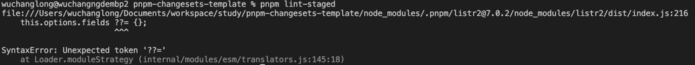

## 总结

## 参考文章

- [pnpm官网地址](https://pnpm.io/zh/)
- [精读《pnpm》](https://zhuanlan.zhihu.com/p/553804414)
- [eslint中文网](https://zh-hans.eslint.org/)
- [Prettier中文网](https://www.prettier.cn/)
- [conventional-changelog官网地址](https://commitlint.js.org/#/)
- [father官网地址](https://github.com/umijs/father)
